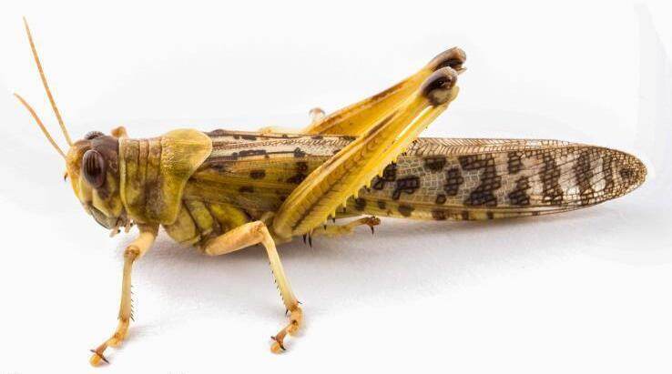
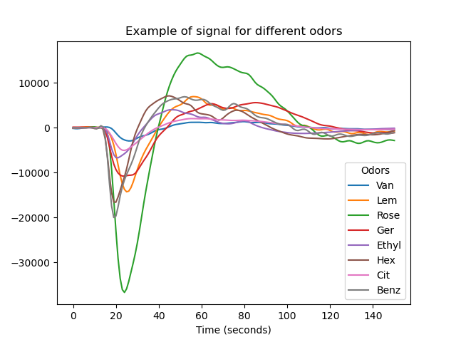
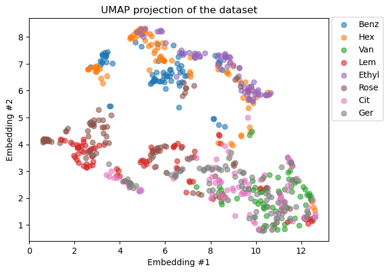

title:
Odor Classification with Machine Learning

Introduction:
Identifying chemical odors rapidly and accurately is critical in various fields. To achieve this, scientists have been developing electronic sensing devices, but these devices are still limited compared to the capabilities of animals sensors. Therefore, researchers are turning to a new approach: Bio-Hybrid sensors, which combine animal biological sensors with electronic components to achieve maximum detection and classification. In this project, we explore various machine learning techniques to classify these signals and identify the odor associated with them.

Presentation of the dataset:
This dataset was graciously provided by N. Shvil from the University of Tel Aviv. She developed an experiment that allowed her to record the electric signal of a locust antenna submitted to various odors.

The dataset consists of about 1000 signals representing 8 different odors. The dataset is roughly balanced with 100–130 signals in each label that span over 1.5 second of recording in 100 hertze (150 data points).

Odors:
- Benz: Benzaldehyde
- Hex: 1-Hexanol
- Ethyl: Ethyl-butyrate
- Rose: Rosemary
- Lem: Lemon
- Ger: Geraniol
- Cit: $\beta$-citronellol
- Van: Vanilla

Sample of signal for the 8 differents odors.
Problems encountered and strategies to overcome them:
We had two main issues with our dataset. First, the size of the dataset limited the complexity of the model we could use, and second, the mixed odors were removed from the dataset.

1. Data augmentation in order to augment the number of samples
There are multiple ways to perform data augmentation. The main idea behind it is to try to generate new signals from the signal distribution without adding too much noise.

add samuel’s part

2. dimensionality reduction
We also explored the Linear Discriminant Analysis (LDA) and Uniform Manifold (UMAP) methods in order to reduce significantly the number of features.

The LDA method of dimensionality reduction focuses on maximizing the separability between the labels in order to better classify them. The outputted feature size is the number of label — 1.

UMAP on the other hand, is a fairly flexible non-linear dimension reduction algorithm. It seeks to learn the manifold structure of your data and find a low dimensional embedding that preserves the essential topological structure of that manifold ( cite ).

In our example, this reduced the performance of the MLP drastically.

3.  Feature extraction
Another possible processing of the signal is to take the first and second derivatives of the signal (Savitszky-Golay filter). This roughly compares to taking the speed and the acceleration of the signal and enable to isolate the local minima and maxima of the signal.

In our case, the first and second derivative was added to the dataset, enlarging the features.

4. Clipping the data
Finally, a last option was to clip the signals between x and y to reduce the number of features in comparison with the number of data.

At the end of the preprocessing steps, the size of the train set was 100 time points long.

5. Model performance and hyperparameter tunning
So far, the best model that we obtain is a random forest model with data that have been, clipped scaled, and adding the derivatives.

In this configuration, the accuracy on the test set was 80 %

Below is reported the F1_score on each orders.

|-------|----------|
| label | F1-score |
|-------|----------|
| Benz  |    0.857 |
|-------|----------|
| Hex   |    0.898 |
|-------|----------|
| Ethyl |    0.909 |
|-------|----------|
| Rose  |    0.734 |
|-------|----------|
| Lem   |    0.705 |
|-------|----------|
| Ger   |    0.721 |
|-------|----------|
| Cit   |    0.627 |
|-------|----------|
| Van   |    0.930 |
|-------|----------|

6. Conclusion and further prospects

For more information the published article is liked at: [The Locust antenna as an odor discriminator](https://www.sciencedirect.com/science/article/abs/pii/S0956566322009599)